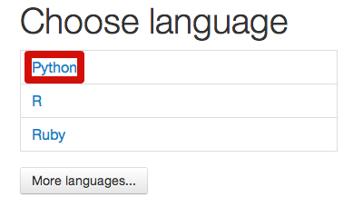
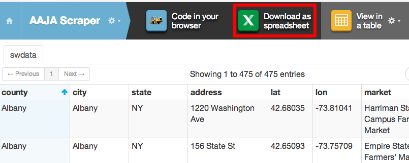

#Webscraping 101

A step-by-step guide for AAJA National Convention NYC 2013 session [Webscraping 101](http://sched.co/18F13ss), hosted by [Frank Bi](https://github.com/frankbi), [Dan Hill](https://github.com/danhillreports) and [Albert Sun](https://github.com/albertsun/). Follow this tutorial and we guarantee you will take home a spreadsheet of farmer's markets 

You can see the finished scraper code we'll be writing [here](https://github.com/frankbi/AAJA-Scraper/blob/master/scraper.py) or with extra comments [here](https://github.com/frankbi/AAJA-Scraper/blob/master/comments_scraper.py).

##Part 1: Getting started with ScraperWiki

There are lots of ways to scrape, but we'll use [ScraperWiki](https://scraperwiki.com/) - a service that lets you write and run scrapers and save data on its website - for this workshop.

Sign up for an account on the ScraperWiki [website](https://scraperwiki.com/) and select "Create a new dataset." Then select "Code in your broweser" and choose Python as your language.




##Part 2: Always be inspectin'

Before we start scraping, we need to study the HTML on our pages to determine our gampeplan for scraping the data. In particular, there are two big questions we need to answer:

How do we scrape data out of a page?
How do we proceed to other pages?

Let's take a look at our website, Frank's list of [New York City Farmers' Markets](http://frankbi.com/aaja/farmermarkets/). Open your browser's web inspector or view the page source. You'll see the data we want is kept in a big HTML table inside `<td>` tags. So, in order to scrape data out of the page, we'll need to get the text out of all the `<td>` tags.

Now check out the links at the top of the page. You'll see the links are inside a `<ul>` tag with the id "pages". The links take you to pages with URL endings: /page1.html, /page2.html, /page3.html. This tells us we'll need to collect all those links from the "pages" `<ul>` and scrape the tables on each of those links. Plan! Now let's start scraping.

##Part 3: Scraping your first page

We'll start by attacking the first part of our gameplan: scraping a single page by getting text out of `<td>` tags in the `<table>`.

ScraperWiki lets you use different code libraries to scrape, but we're going to use the Python libraries [BeautifulSoup](http://www.crummy.com/software/BeautifulSoup/). Import the BeautifulSoup library to our scraper:

```python
#!/usr/bin/env python
 
import scraperwiki
import requests
from bs4 import BeautifulSoup
```

Now we're ready to get our first page to scrape. We're scraping from Frank's [website](http://frankbi.com/aaja/farmermarkets/), so let's make a variable to store the URL to Frank's page.

```python
base_url = 'http://frankbi.com/aaja/farmermarkets/page1.html'
```

We scrape a page by getting requesting the page and "soupifying" it with BeautifulSoup. In other words:

```python	
html = requests.get(base_url)
soup = BeautifulSoup(html.content, "html.parser")
```

This uses the requests library to get the HTML from the base_url variable and "soupifies" the HTML with BeautifulSoup, which lets us use commands from the BeautifulSoup library to select content. We can select the big `<table>` tag like this:

```python
table = soup.findAll('table')
```

The findAll command returns a list with everything that matches what you want to find, in this case `<table>` tags inside the soupified page. We set the result of the findAll command to a variable, so now the variable "table" is storing everything on the page in a `<table>` tag. That means it contains the `<td>` tags that contain the text data we want to scrape, nested in `<tr>` row tags. Beautiful Soup lets us select within the "table" variable, so we can grab all those `<tr>` tags and put them in another variable:

```python
rows = table[0].findAll("tr")
```

Recall findAll returns a list of the elements that match your query, so we call findAll on the first element of the list in the "table" variable, table[0].

Likewise, now the "rows" variable is a list with all the `<tr>` rows and the `<td>` tags inside them. We need to go through each of the rows and get the text in the `<td>`s, so we will use a python loop. Also, we need to skip the `<th>` tags because all the data we really want are in `<td>` tags.

```python
if len(soup.findAll('th')) > 0:
        rows = rows[1:]

for row in rows:
        cells = row.findAll('td')
        data = {
            'county' : cells[0].get_text(),
            'market' : cells[1].get_text(),
            'address' : cells[2].get_text(),
            'city' : cells[3].get_text(),
            'state' : cells[4].get_text(),
            'zip_code' : cells[5].get_text(),
            'lat' : cells[6].get_text(),
            'lon' : cells[7].get_text()
        }
        print data
```

The "cells" variable holds a list of all the `<td>` tags in the current row, and we index into "cells" to get the text we want by calling the BeautifulSoup function get_text(). Now we're scraping!

##Part 4: Scrape all the pages!

We can scrape text out of the HTML tables on a page and now we need to scrape all five of the pages on Frank's site. As we discussed in part 2, we need to get the links out of the `<ul>` tag with the "pages" id and visit all those links. Let's start by initializing a list called page_array at the top of our code that will hold the links to each of the pages.

```python
page_array = []
```

Now let's grab that `<ul>` with id "pages" and loop through all the `<a>` tags inside it to grab their links and append them to the "page_array" list:

```python
page_list = soup.findAll(id='pages')
pages = page_list[0].findAll('a')

for page in pages:
    page_array.append(page.get('href'))
```

Now "page_array" holds links, or the suffixes (remember the links are in the form "/page1.html", "/page2.html", etc.). We need to go to each page by concatenating the "base_url" with these link suffixes and call the code for scraping HTML table.

Let's take a step back and make some functions so we can reuse the code we've written for different pages. 

```python
def get_pages():
    html = requests.get(base_url+'page5.html')
    soup = BeautifulSoup(html.content, "html.parser")
    
    page_list = soup.findAll(id='pages')
    pages = page_list[0].findAll('a')
    
    for page in pages:
        page_array.append(page.get('href'))

def scrape_page(page):
    html = requests.get(page)
    soup = BeautifulSoup(html.content, "html.parser")

    table = soup.findAll('table')
    rows = table[0].findAll('tr')

    if len(soup.findAll('th')) > 0:
        rows = rows[1:]

    for row in rows:
        cells = row.findAll('td')
        data = {
            'county' : cells[0].get_text(),
            'market' : cells[1].get_text(),
            'address' : cells[2].get_text(),
            'city' : cells[3].get_text(),
            'state' : cells[4].get_text(),
            'zip_code' : cells[5].get_text(),
            'lat' : cells[6].get_text(),
            'lon' : cells[7].get_text()
        }
```

Now get_pages() is the function that fills the "page_array" variable, and scrape_page() is a function that takes a URL and scrapes the table on that page. We have to run get_pages() first to fill "page_array", then loop through "page_array" to call scrape_page() on the links. Since "page_array" contains link suffixes, we have to concatenate "base_url" with each link in "page_array". Finally, we use a python list comprehension to loop the links, because we fancy like that. Add these lines to the bottom of your scraper code:

```python
get_pages()
[scrape_page(base_url + page) for page in page_array]
```

##Part 5: Get that data

We almost have structured data! Right now our scraper is just grabbing text and printing it, but we want to save the data we scraped and download it in a spreadsheet. ScraperWiki let's us save data to their website and download that data in different formats.

We've been saving our scraped data to a variable called "data", which is a dictionary that holds the scraped text as values to its keys. ScraperWiki let's us save that data to a database by unpacking that dictionary variable. Add this line beneath the "data" variable on the same level of indentation:

```python
scraperwiki.sql.save(data.keys(), data)
```

Running your scraper code now will save data to ScraperWiki. We can look at that data in a table on the ScraperWiki site or download the data as a spreadsheet.



You did it, structured data is yours to analayze!

##References

ScraperWiki is a handy service, but there are lots of tools, libraries and techniques for scraping. Some open source tools built by journalists include [Upton](http://www.propublica.org/nerds/item/upton-a-web-scraping-framework) and [Haystax](https://github.com/tilgovi/haystax).

[Always be scrapin!](http://www.youtube.com/watch?v=hQGLNPJ9VCE)
